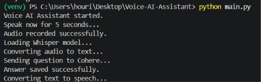
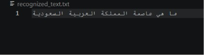
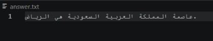

# Voice AI Assistant

## وصف المشروع

هذا المشروع عبارة عن مساعد صوتي ذكي تم تطويره باستخدام لغة Python.

يقوم المشروع بتحويل كلام المستخدم إلى نص باستخدام نموذج **Whisper**، ثم يرسل النص إلى **Cohere AI** للحصول على إجابة مناسبة، وبعد ذلك يحول الإجابة إلى صوت باستخدام **gTTS** ويقوم بتشغيلها.

---

## آلية عمل المشروع

يقوم المشروع بالخطوات التالية:

1. تسجيل صوت المستخدم.
2. تحويل الصوت إلى نص باستخدام Whisper.
3. إرسال النص إلى Cohere AI للحصول على إجابة.
4. حفظ الإجابة في ملف نصي.
5. تحويل الإجابة إلى صوت باستخدام gTTS.
6. تشغيل الإجابة الصوتية.

---

## ملفات المشروع

- `main.py` : تشغيل المشروع بالكامل.
- `speech_to_text.py` : تحويل الصوت إلى نص باستخدام Whisper.
- `ai_response.py` : إرسال السؤال إلى Cohere واستقبال الإجابة.
- `text_to_speech.py` : تحويل النص إلى صوت باستخدام gTTS.
- `requirements.txt` : يحتوي على جميع المكتبات المطلوبة لتشغيل المشروع.
- `recognized_text.txt` : يحتوي على النص الذي تم التعرف عليه من صوت المستخدم.
- `answer.txt` : يحتوي على الإجابة التي تم توليدها بواسطة Cohere.

---

## المكتبات المستخدمة

- Python
- openai-whisper
- cohere
- python-dotenv
- sounddevice
- scipy
- gtts
- playsound

---

## طريقة التشغيل

بعد تثبيت جميع المكتبات المطلوبة، يتم تشغيل المشروع باستخدام الأمر التالي:

```
python main.py
```

بعد تشغيل المشروع:

- يتحدث المستخدم لمدة 5 ثوانٍ.
- يتم تحويل الصوت إلى نص باستخدام Whisper.
- يتم إرسال النص إلى Cohere AI.
- يتم إنشاء الإجابة.
- يتم حفظ الإجابة في ملف نصي.
- يتم تحويل الإجابة إلى صوت وتشغيلها.

---

## التقنيات المستخدمة

- Python
- Whisper
- Cohere API
- Speech Recognition
- Text To Speech (gTTS)

---

# مثال على تشغيل المشروع

## 1. تشغيل المشروع

توضح الصورة التالية تشغيل المشروع بنجاح وتنفيذ جميع المراحل من تسجيل الصوت وحتى تشغيل الإجابة.



---

## 2. النص الذي تم التعرف عليه

تم تحويل كلام المستخدم إلى نص باستخدام نموذج Whisper.



---

## 3. إجابة الذكاء الاصطناعي

تم إرسال النص إلى Cohere AI، ثم قام النموذج بتوليد الإجابة كما هو موضح في الصورة التالية.



---

## 4. الملف الصوتي الناتج

يمكن الاستماع إلى الإجابة الصوتية الناتجة من خلال الرابط التالي:

[▶️ الاستماع إلى الإجابة الصوتية](answer.mp3)
